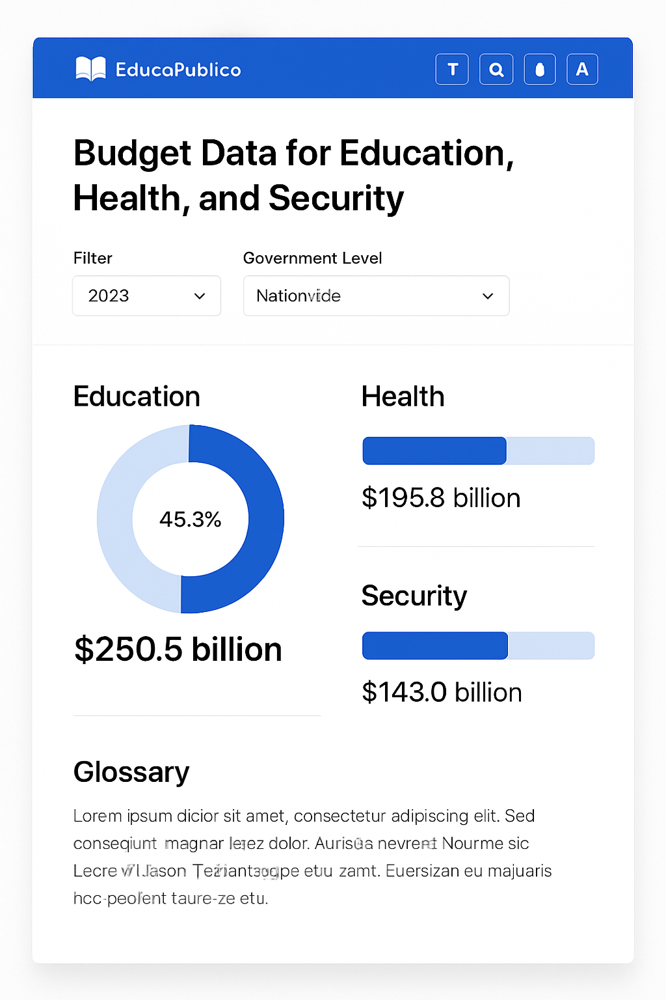
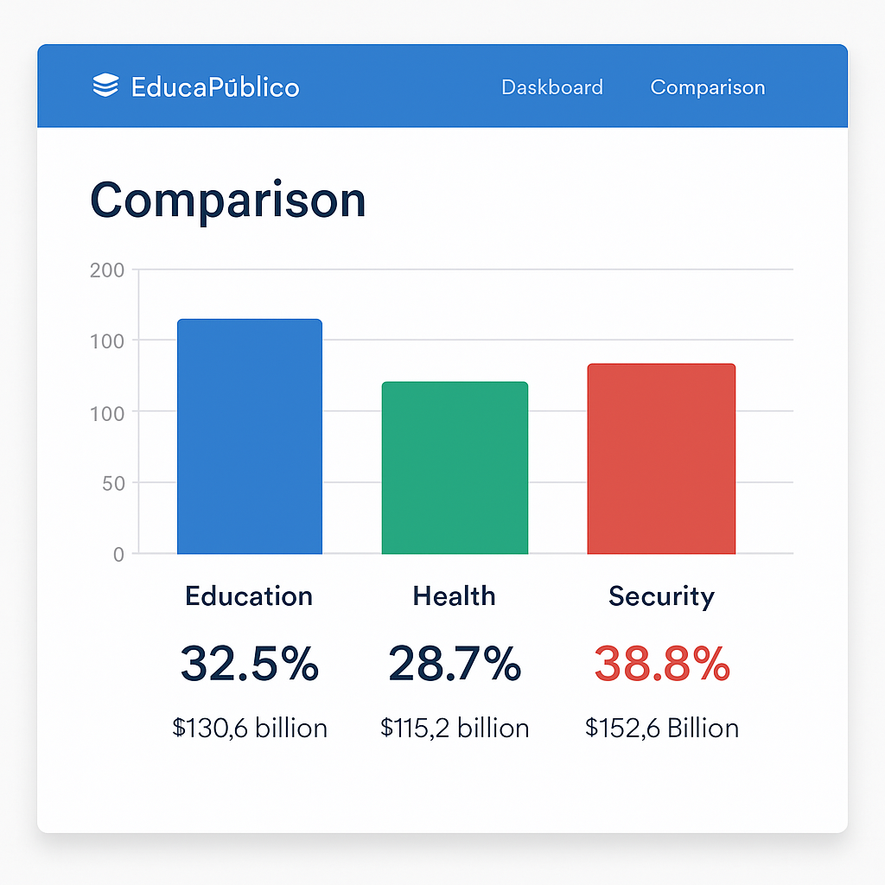

# README.md - EducaPúblico

## Sobre o Projeto

O EducaPúblico é uma plataforma web que visa aumentar a educação política da população brasileira através da visualização simplificada de dados orçamentários nas áreas de Educação, Saúde e Segurança, em níveis federal e estadual.

## Características Principais

- **Visualização simplificada** de dados orçamentários governamentais
- **Foco em três áreas prioritárias**: Educação, Saúde e Segurança
- **Múltiplos níveis de governo**: Federal e Estadual (com expansão futura para Municipal)
- **Suporte a múltiplos idiomas**: Português do Brasil (principal), Inglês e Espanhol
- **Contadores de acesso**: Total de visitas e usuários únicos
- **Design acessível**: Seguindo diretrizes WCAG para acessibilidade web
- **Segurança de dados**: Garantia de integridade das informações apresentadas

## Tecnologias Utilizadas

- **Frontend**: React, TypeScript, Tailwind CSS
- **Visualização de Dados**: Recharts
- **Internacionalização**: i18next
- **Hospedagem**: GitHub Pages

## Começando

Para instruções detalhadas sobre como instalar e implantar o projeto, consulte o arquivo [INSTALACAO.md](./INSTALACAO.md).

Para entender a arquitetura e os requisitos do projeto, consulte a [DOCUMENTACAO.md](./DOCUMENTACAO.md).

## Capturas de Tela

### Página Inicial

### Comparativo entre Áreas

## Contribuição

Contribuições são bem-vindas! Sinta-se à vontade para abrir issues ou enviar pull requests.

## Licença

Este projeto está licenciado sob a licença MIT - veja o arquivo LICENSE para detalhes.

## Contato

Abner Netto - [GitHub](https://github.com/Abnernnetto)
